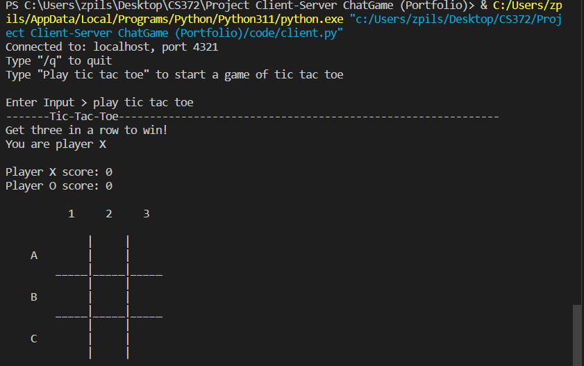
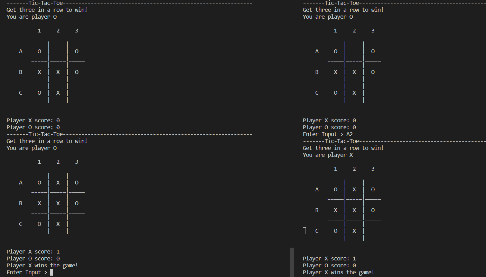
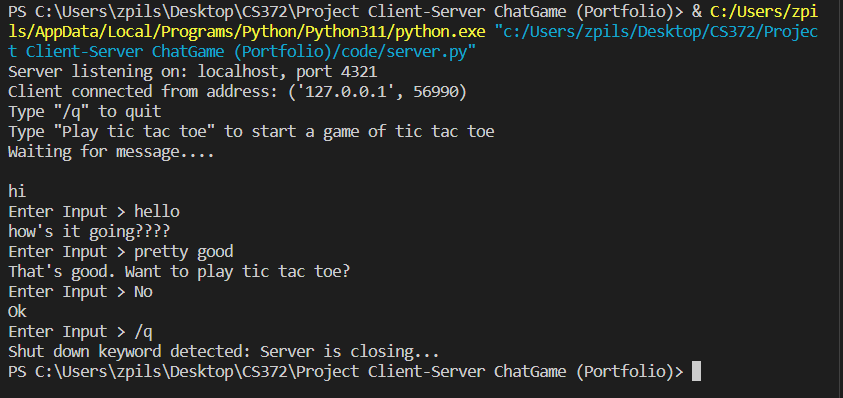

# CS372-Client-Server-Terminal-Chat-Game
A simple client-server Tic-Tac-Toe game written in **Python 3**. The game uses sockets for direct communication between a server and a client, allowing two users on the same machine or local network to play against each other.

## Files
- `server.py` – Starts the server and listens for incoming client connections  
- `client.py` – Connects to the server and initiates interaction  
- `socketHelperFunctions.py` – Contains reusable socket utility functions  
- `tic_tac_toe_class.py` – Implements game logic and board structure  

## Configuration
You can change the hosted ***address*** and ***port number*** in `socketHelperFunctions.py`

## How to Run
1. Open two terminal windows
2. Run the server in the first terminal: `python server.py`, should say "Server is listening on: localhost, port 4321"
3. Run the client in the second terminal: `python client.py`, should say "Enter Input>"
4. On the client-side, enter `Play tic tac toe` to start the game.

## How to Play
Use “/q” to close all opened sockets (server and client).
Use “Play tic tac toe” (not case sensitive) to start a game of tic tac toe (client only).
Use the coordinate system (A1,B1,C1,A2,...) to pick your spot to mark on the board when it's the appropriate sides turn (server and client).

## 
`client.py` (“Play tic tac toe”- starts game, example)

Both `server.py` and `client.py` (tic tac toe, end of game side by side)

`server.py` (Chat and “/q”- quit example)

